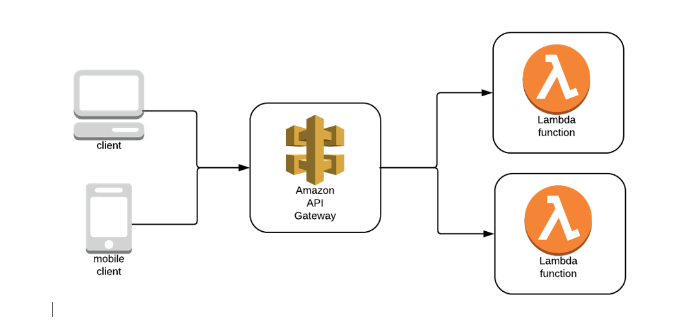
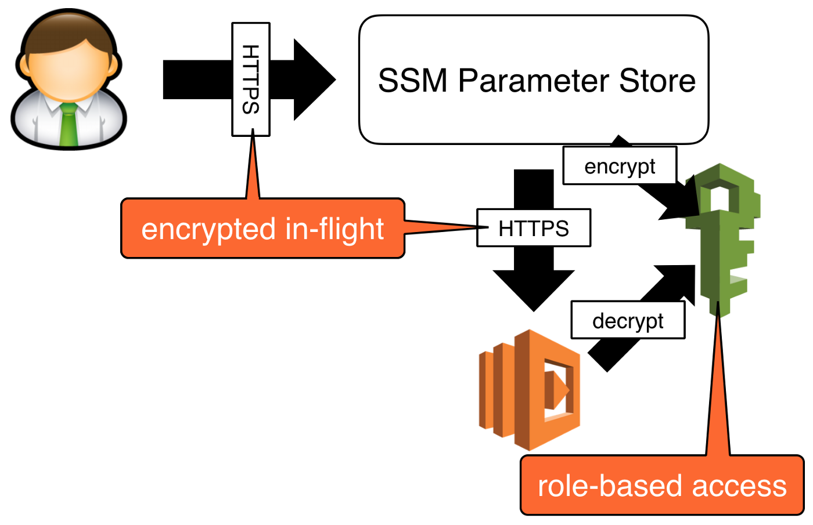

# Api_MaquinasIndustriales_ServerlessBucketS3_NodeJs
* Microservicio Api Rest para la Gestión de Máquinas Industriales implementando Serverless, Api Gateway, SSM, Bucket S3, NodeJs y Otras Tecnologías.


<br>

## Índice 📜

<details>
 <summary> Ver </summary>
 
 <br>
 
### Sección 1) Descripción, Tecnologías y Dependencias 
 
 - [1.0) Descripción del Proyecto.](#10-descripción-)
 - [1.1) Ejecución del Proyecto.](#11-ejecución-del-proyecto-)
 - [1.2) Tecnologías.](#12-tecnologías-)
 - [1.3) Plugins.](#13-plugins-)
 - [1.4) Extensiones VSC.](#14-extensiones-vsc-)
 
### Sección 2) Proyecto Serverless desde cero 
 
 - [2.0) Instalación y Configuración de Serverless Local](#20-instalación-y-configuración-de-serverless-local-)
 - [2.1) Configuración de Api Gateway](#21-configuración-de-api-gateway-) 
 - [2.2) Ejecución de Serverless Local](#22-ejecución-de-serverless-local-)
 - [2.3) SSM y IAM](#23-ssm-y-iam-)
      - [2.3.1) Instalación y Configuración de SSM Local](#231-instalación-y-configuración-de-ssm-local-)
 


<br>

</details>


<br>

## Sección 1) Descripción, Tecnologías y Dependencias 


### 1.0) Descripción [🔝](#índice-) 

<details>
  <summary>Ver</summary>
 
 <br>

* ipsum

<br>

</details>


### 1.1) Ejecución del Proyecto [🔝](#índice-)

<details>
  <summary>Ver</summary>

* Crear un entorno de trabajo a través de algún IDE
* Clonar el Proyecto ( `git clone https://github.com/andresWeitzel/Api_MaquinasIndustriales_ServerlessBucketS3_NodeJs` )
* Dentro del directorio instalar todos los plugins implementados
  * `npm install -g serverless`
  * `npm i serverless-offline`
  * `npm install serverless-offline serverless-offline-ssm --save-dev`
  * `npm install serverless-s3-local --save-dev`
* Levantar Serverless en Local (`sls offline start`)
* Comprobar respuestas de los endpoints generados a través de alguna herramienta Cliente Http (Ej:Postman)


<br>

</details>


### 1.2) Tecnologías [🔝](#índice-)

<details>
  <summary>Ver</summary>
 
 <br>

| **Tecnologías** | **Versión** | **Finalidad** |               
| ------------- | ------------- | ------------- |
| [SDK](https://www.serverless.com/framework/docs/guides/sdk) | 4.3.2  | Inyección Automática de Módulas para Lambdas |
| [Serverless Framework Core](https://www.serverless.com//blog/serverless-framework-v3-is-live) | 3.23.0 | Core Servicios AWS |
| [Serverless Plugin](https://www.serverless.com/plugins) | 6.2.2  | Librerías para la Definición Modular |
| [Systems Manager Parameter Store (SSM)](https://docs.aws.amazon.com/systems-manager/latest/userguide/systems-manager-parameter-store.html) | 3.0 | Manejo de Variables de Entorno |
| [Amazon Api Gateway](https://docs.aws.amazon.com/apigateway/latest/developerguide/welcome.html) | 2.0 | Gestor, Autenticación, Control y Procesamiento de la Api |
| [Amazon S3 Bucket](https://aws.amazon.com/es/s3/) | 3.0 | Contenedor de Objetos |
| [NodeJS](https://nodejs.org/en/) | 14.18.1  | Librería JS |
| [VSC](https://code.visualstudio.com/docs) | 1.72.2  | IDE |
| [Postman](https://www.postman.com/downloads/) | 10.11  | Cliente Http |
| [CMD](https://learn.microsoft.com/en-us/windows-server/administration/windows-commands/cmd) | 10 | Símbolo del Sistema para linea de comandos | 
| [Git](https://git-scm.com/downloads) | 2.29.1  | Control de Versiones |


<br>

</details>


### 1.3) Plugins [🔝](#índice-)

<details>
  <summary>Ver</summary>
 
| **Plugin** | 
| ------------- |
| [serverless-offline](https://www.serverless.com/plugins/serverless-offline) |
| [serverless-offline-ssm](https://www.npmjs.com/package/serverless-offline-ssm) |
| [serverless-s3-local](https://www.serverless.com/plugins/serverless-s3-local) |


<br>

</details>


### 1.4) Extensiones VSC [🔝](#índice-)

<details>
 <summary>Ver</summary>

| **Extensión** |              
| -------------  | 
| Prettier - Code formatter |
| YAML - Autoformatter .yml (alt+shift+f) |
| YAML-fm Linter |
| DotENV |

<br>

</details>


<br>

## Sección 2) Proyecto Serverless desde cero

### Arquitectura Lambda Function y Api gateway 

<details>
  <summary>Ver</summary>
 
 
 <br>
 


<br>
 

</details>


### 2.0) Instalación y Configuración de Serverless Local [🔝](#índice-)

<details>
 <summary>Ver</summary>
 
 <br>

* Una vez abierto el proyecto instalamos  serverless de forma Global `npm install -g serverless`
* Seguidamente creamos toda la config de serverless para nuestro proyecto(en mi caso el nombre del proyecto es `api-maquinas-industriales` ) `serverless create --template aws-nodejs --path api-maquinas-industriales && cd api-maquinas-industriales`
* Luego inicializamos el package.json en el proyecto `npm init -y`.
* Instalamos el plugin serverless-offline `npm i serverless-offline`
* Comprobamos versión `serverless --version`
* Salida Esperada ..

   ``` bash
    Framework Core: 3.23.0
    Plugin: 6.2.2
    SDK: 4.3.2

   ```
* Agregamos el plugin instalado de serverless-offline al archivo `serverless.yml`
* Configuramos los diversos parámetros necesarios del provider
* Vamos a trabajar todas las lambdas dentro del directorio `src/lambdas/` por asuntos de modularización de código
* Renombramos la lambda `handler.js` para `hello.js`
* Configuramos tipo de método y path a través de httpApi.
* Configuramos el puerto http 
* Archivo serveless.yml..

  ``` yml
  

      service: api-maquinas-industriales

      frameworkVersion: '3'

      provider:
        name: aws
        runtime: nodejs14.x
        stage: offline
        region : us-west-1
        memorySize: 512
        timeout : 20

      plugins:
        - serverless-offline 

      custom: 
        serverless-offline:
          httpPort: 4000 


      functions:
        hello:
          handler: src/lambdas/hello.msg
          events:
            - httpApi:
                method: GET
                path: hello


  ```
* La lambda `hello.js` la movemos al directorio ya mencionado `src/lambdas/`
* Archivo Lambda hello.js..
    
    ```js
     'use strict';

      module.exports.msg = async (event) => {
        return {
          statusCode: 200,
          body: JSON.stringify(
            {
              message: 'HELLO',
              input: event,
            },
            null,
            2
          ),
        };

      };

    
    ```
   
  
<br>   

* Guía Oficial : https://www.serverless.com//blog/serverless-framework-v3-is-live   
* Guía Recomendada : https://medium.com/@patricio.aranguiz/serverless-offline-aws-lambda-api-gateway-15a4dfdfbc16
* Config Parámetros Provider : https://www.tutorialspoint.com/serverless/serverless_regions_memory_size_timeouts.htm


<br>

</details>


 
### 2.1) Configuración de Api Gateway [🔝](#índice-) 

<details>
 <summary>Ver</summary>
 
 <br>
 
* API Gateway gestiona todas las tareas relacionadas con la aceptación y el procesamiento de centenares de miles de llamadas simultáneas a la API. Estas tareas incluyen la administración del tráfico, el control de la autorización y el acceso, el monitoreo y la administración de versiones de la API.
* No es necesario la instalación de ningún paquete adicional, este servicio viene incluido en la instalación principal de serverless.
* Para cada lambda es necesario adicionar el parametro `private: true` dentro de `- httpApi` para que se aplique la restricción de acceso correctamente.
* Vamos a generar una sección de `resources` . Esta es la plantilla de CloudFormation (Servicio de recursos de AWS) para declarar los recursos de serverless a utilizar.
* En este caso vamos a extender los diversos manejos de recursos para nuestra Api Gateway. (Tipos, Templates y Códigos de Respuesta).
* La configuración General de nuestro `serverless.yml` quedaría...

     ``` yml
  
      service: api-maquinas-industriales

      frameworkVersion: '3'

      provider:
        name: aws
        runtime: nodejs14.x
        stage: offline
        region : us-west-1
        memorySize: 512
        timeout : 20

      plugins:
        - serverless-offline 

      custom: 
        serverless-offline:
          httpPort: 4000 


      functions:
        hello:
          handler:  src/lambdas/hello.msg
          events:
            - httpApi:
                method: GET
                path: hello
                private: true

   resources:
     Resources:
       ApiGatewayRestApi:
         Type: AWS::ApiGateway::RestApi
         Properties:
           Name: apiGatewayRestApi
       #### Gateway Response INIT
       GatewayResponseDefault400:
         Type: 'AWS::ApiGateway::GatewayResponse'
         Properties:
           RestApiId: 
             Ref: 'ApiGatewayRestApi'
           ResponseType: DEFAULT_4XX
           ResponseTemplates:
             application/json: "{\"error\":{\"code\":\"custom-4XX-generic\",\"message\":$context.error.messageString},\"requestId\":\"$context.requestId\"}"
       GatewayResponseDefault500:
         Type: 'AWS::ApiGateway::GatewayResponse'
         Properties:
           RestApiId: 
             Ref: 'ApiGatewayRestApi'
           ResponseType: DEFAULT_5XX
           ResponseTemplates:
             application/json: "{\"error\":{\"code\":\"custom-5XX-generic\",\"message\":$context.error.messageString},\"requestId\":\"$context.requestId\"}"
       GatewayResponseAccessDeied:
         Type: 'AWS::ApiGateway::GatewayResponse'
         Properties:
           RestApiId: 
             Ref: 'ApiGatewayRestApi'
           ResponseType: ACCESS_DENIED
           ResponseTemplates:
             application/json: "{\"error\":{\"code\":\"custom-403-access-denied\",\"message\":$context.error.messageString},\"requestId\":\"$context.requestId\"}"
       GatewayResponseApiConfigurationError:
         Type: 'AWS::ApiGateway::GatewayResponse'
         Properties:
           RestApiId: 
             Ref: 'ApiGatewayRestApi'
           ResponseType: API_CONFIGURATION_ERROR
           ResponseTemplates:
             application/json: "{\"error\":{\"code\":\"custom-500-api-configuration-error\",\"message\":$context.error.messageString},\"requestId\":\"$context.requestId\"}"
       GatewayResponseAuthorizerConfigurationError:
         Type: 'AWS::ApiGateway::GatewayResponse'
         Properties:
           RestApiId: 
             Ref: 'ApiGatewayRestApi'
           ResponseType: AUTHORIZER_CONFIGURATION_ERROR
           ResponseTemplates:
             application/json: "{\"error\":{\"code\":\"custom-500-authorizer-configuration-error\",\"message\":$context.error.messageString},\"requestId\":\"$context.requestId\"}"
       GatewayResponseAuthorizerFailure:
         Type: 'AWS::ApiGateway::GatewayResponse'
         Properties:
           RestApiId: 
             Ref: 'ApiGatewayRestApi'
           ResponseType: AUTHORIZER_FAILURE
           ResponseTemplates:
             application/json: "{\"error\":{\"code\":\"custom-500-authorizer-failure\",\"message\":$context.error.messageString},\"requestId\":\"$context.requestId\"}"
       GatewayResponseBadRequestBody:
         Type: 'AWS::ApiGateway::GatewayResponse'
         Properties:
           RestApiId: 
             Ref: 'ApiGatewayRestApi'
           ResponseType: BAD_REQUEST_BODY
           ResponseTemplates:
             application/json: "{\"error\":{\"code\":\"custom-400-bad-request-body\",\"message\":$context.error.messageString},\"requestId\":\"$context.requestId\"}"
       GatewayResponseBadRequestParameters:
         Type: 'AWS::ApiGateway::GatewayResponse'
         Properties:
           RestApiId: 
             Ref: 'ApiGatewayRestApi'
           ResponseType: BAD_REQUEST_PARAMETERS
           ResponseTemplates:
             application/json: "{\"error\":{\"code\":\"custom-400-bad-request-parameters\",\"message\":$context.error.messageString},\"requestId\":\"$context.requestId\"}"
       GatewayResponseExpiredToken:
         Type: 'AWS::ApiGateway::GatewayResponse'
         Properties:
           RestApiId: 
             Ref: 'ApiGatewayRestApi'
           ResponseType: EXPIRED_TOKEN
           ResponseTemplates:
             application/json: "{\"error\":{\"code\":\"custom-403-expired-token\",\"message\":$context.error.messageString},\"requestId\":\"$context.requestId\"}"
       GatewayResponseIntegrationFailure:
         Type: 'AWS::ApiGateway::GatewayResponse'
         Properties:
           RestApiId: 
             Ref: 'ApiGatewayRestApi'
           ResponseType: INTEGRATION_FAILURE
           ResponseTemplates:
             application/json: "{\"error\":{\"code\":\"custom-504-integration-failure\",\"message\":$context.error.messageString},\"requestId\":\"$context.requestId\"}"
       GatewayResponseIntegrationTimeout:
         Type: 'AWS::ApiGateway::GatewayResponse'
         Properties:
           RestApiId: 
             Ref: 'ApiGatewayRestApi'
           ResponseType: INTEGRATION_TIMEOUT
           ResponseTemplates:
             application/json: "{\"error\":{\"code\":\"custom-504-integration-timeout\",\"message\":$context.error.messageString},\"requestId\":\"$context.requestId\"}"
       GatewayResponseInvalidApiKey:
         Type: 'AWS::ApiGateway::GatewayResponse'
         Properties:
           RestApiId: 
             Ref: 'ApiGatewayRestApi'
           ResponseType: INVALID_API_KEY
           ResponseTemplates:
             application/json: "{\"error\":{\"code\":\"custom-403-invalid-api-key\",\"message\":$context.error.messageString},\"requestId\":\"$context.requestId\"}"
       GatewayResponseInvalidSignature:
         Type: 'AWS::ApiGateway::GatewayResponse'
         Properties:
           RestApiId: 
             Ref: 'ApiGatewayRestApi'
           ResponseType: INVALID_SIGNATURE
           ResponseTemplates:
             application/json: "{\"error\":{\"code\":\"custom-403-invalid-signature\",\"message\":$context.error.messageString},\"requestId\":\"$context.requestId\"}"
       GatewayResponseMissingAuthenticationToken:
         Type: 'AWS::ApiGateway::GatewayResponse'
         Properties:
           RestApiId: 
             Ref: 'ApiGatewayRestApi'
           ResponseType: MISSING_AUTHENTICATION_TOKEN
           ResponseTemplates:
             application/json: "{\"error\":{\"code\":\"custom-403-missing-authentication-token\",\"message\":$context.error.messageString},\"requestId\":\"$context.requestId\"}"
       GatewayResponseQuotaExceeded:
         Type: 'AWS::ApiGateway::GatewayResponse'
         Properties:
           RestApiId: 
             Ref: 'ApiGatewayRestApi'
           ResponseType: QUOTA_EXCEEDED
           ResponseTemplates:
             application/json: "{\"error\":{\"code\":\"custom-429-quota-exceeded\",\"message\":$context.error.messageString},\"requestId\":\"$context.requestId\"}"
       GatewayResponseRequestTooLarge:
         Type: 'AWS::ApiGateway::GatewayResponse'
         Properties:
           RestApiId: 
             Ref: 'ApiGatewayRestApi'
           ResponseType: REQUEST_TOO_LARGE
           ResponseTemplates:
             application/json: "{\"error\":{\"code\":\"custom-413-request-too-large\",\"message\":$context.error.messageString},\"requestId\":\"$context.requestId\"}"
       GatewayResponseResourceNotFound:
         Type: 'AWS::ApiGateway::GatewayResponse'
         Properties:
           RestApiId: 
             Ref: 'ApiGatewayRestApi'
           ResponseType: RESOURCE_NOT_FOUND
           ResponseTemplates:
             application/json: "{\"error\":{\"code\":\"custom-404-resource-not-found\",\"message\":$context.error.messageString},\"requestId\":\"$context.requestId\"}"
       GatewayResponseThrottled:
         Type: 'AWS::ApiGateway::GatewayResponse'
         Properties:
           RestApiId: 
             Ref: 'ApiGatewayRestApi'
           ResponseType: THROTTLED
           ResponseTemplates:
             application/json: "{\"error\":{\"code\":\"custom-429-throttled\",\"message\":$context.error.messageString},\"requestId\":\"$context.requestId\"}"
       GatewayResponseUnauthorized:
         Type: 'AWS::ApiGateway::GatewayResponse'
         Properties:
           RestApiId: 
             Ref: 'ApiGatewayRestApi'
           ResponseType: UNAUTHORIZED
           ResponseTemplates:
             application/json: "{\"error\":{\"code\":\"custom-401-unauthorized\",\"message\":$context.error.messageString},\"requestId\":\"$context.requestId\"}"
       GatewayResponseUnauthorizedMediType:
         Type: 'AWS::ApiGateway::GatewayResponse'
         Properties:
           RestApiId: 
             Ref: 'ApiGatewayRestApi'
           ResponseType: UNSUPPORTED_MEDIA_TYPE
           ResponseTemplates:
             application/json: "{\"error\":{\"code\":\"custom-415-unsupported-media-type\",\"message\":$context.error.messageString},\"requestId\":\"$context.requestId\"}"
       #### Gateway Response END

  ```


* Código Base : https://gist.github.com/jonatassaraiva/4c33dd8225605c02318cd71a55b2335d


<br>

</details>


### 2.2) Ejecución de Serverless Local [🔝](#índice-)

<details>
 <summary>Ver</summary>
 
 <br>

* Por defecto tenemos configurado una lambda llamada hello a través de su función .msg
* Comprobamos la config generada.
* Además tenemos configurada la seguridad y manejo de responses por parte de la Api Gateway, esta nos provera un token de acceso (x-api-key) para el acceso a cada lambda.
* Levantamos serverless con el comando `sls offline start` o `serverless offline start`
* Visualizamos el endpoint local que serverless nos genera..

     ``` bash
     Starting Offline at stage dev (us-east-1)

     Offline [http for lambda] listening on http://localhost:3002
   Function names exposed for local invocation by aws-sdk:
              * hello: api-maquinas-industriales-offline-hello
   Remember to use 'x-api-key' on the request headers.
   Key with token: 'd41d8cd98f00b204e9800998ecf8427e'           
              
    GET | http://localhost:4000/hello   
    POST | http://localhost:4000/2015-03-31/functions/hello/invocations 
    
    Server ready: http://localhost:4000
  ``` 
* Abrimos alguna herramienta para generar peticiones http (ej: Postman) y generamos una request al endpoint generado junto con la api key de nuestro gateway  
* Seleccionamos método `GET`, luego escribimos el endpoint `http://localhost:4000/hello`, seguidamente pestaña `Headers` en `KEY` colocamos `x-api-key` y en `VALUE` colocamos el token generado `d41d8cd98f00b204e9800998ecf8427e`.
* Procedemos a ejecutar la request y podemos comprobar la metadata de la lambda en la consola de postman
* También obtenemos la respuesta por consola..
  
  ``` bash
    GET /hello (λ: hello)
   (λ: hello) RequestId: 63fc1719-ae56-4d56-8296-87d45b44fc96  Duration: 124.64 ms  Billed Duration: 125 ms
  ```

<br>

</details>


### 2.3) SSM e IAM [🔝](#índice-)

#### Arquitectura Lambda Function y SSM 

<details>
 <summary>Ver</summary>
 
<br>
 


<br>

</details>


#### 2.3.1) Instalación y Configuración de SSM Local [🔝](#índice-)


<details>
 <summary>Ver</summary>
 
 <br>
 
* Instalamos el plugin `npm install serverless-offline serverless-offline-ssm --save-dev`
* Agregamos el complemento dentro del serverless.yml. Es importante mantener el orden siguiente (serverless-offline siempre último por temas de compatibilidad).
   
  ``` YML
    plugins:
       - serverless-offline-ssm
       - serverless-offline
  ``` 
* Dentro del proyecto creamos el archivo `serverless.env.yml` que será el que contenga los valores de las variables de entorno de nuestro proyecto
* Dentro de dicho archivo colocamos una variable test para comprobar su funcionamiento.. 
  
  ``` YML
    HELLO_TEST : ${ssm:/hello_test}  
  ```
* Relacionamos el arhivo `serverless.env.yml` dentro del `serverless.yml` agregando el parametro `enviroment` junto a dicho archivo..
 
  ``` YML
   provider:
     name: aws
     runtime: nodejs14.x
     stage: offline
     region : us-west-1
     memorySize: 512
     timeout : 10
     environment: ${file(serverless.env.yml)}  
  ``` 
* Seguidamente vamos a configurar el ssm dentro del bloque `custom` para el archivo `serverless.yml` 
* Agregamos el stage (IMPORTANTE RESPETAR EL STAGE DEL PROVIDER Y DEL SSM) y la variable test, quedando..

  ``` YML
    custom:
     serverless-offline-ssm:
       stages:
         - offline
       ssm:
         '/hello_test': 'HELLO SSM'
     serverless-offline:
       httpPort: 4000  
  ```
* Por último utilizamos dicha variable en la lambda declarada, para invocar una variable de entorno utilizamos `process.env.variable`.
* Ejecutar serverless, es recomendable luego de cada instalación y agregado de plugin reiniciar el IDE para que los cambios se produzcan de forma correcta.
 
    ```js
      'use strict';

      module.exports.hello = async (event) => {
        return {
          statusCode: 200,
          body: JSON.stringify(
            {
              message: process.env.HELLO_TEST,
              input: event,
            },
            null,
            2
          ),
        };

      };

   ```
* Ejecutamos el programa, realizamos la petición get a través de postman a nuestra lambda y podemos visualizar la metadata de la misma junto con nuestra variable de entorno.
* Salida Esperada..

     ```cmd
        {
          "message": "HELLO SSM",
          "input": {
              "body": null,
              "cookies": [],
              "headers": {
                  "x-api-key": "d41d8cd98f00b204e9800998ecf8427e",
                  "content-type": "application/json",
                  "user-agent": "PostmanRuntime/7.29.2",
                  "accept": "*/*",
                  "cache-control": "no-cache",
                  "postman-token": "ea2e186f-732f-450e-abf2-4572b3e0206b",
                  "host": "localhost:4000",
                  "accept-encoding": "gzip, deflate, br",
                  "connection": "keep-alive",
                  "content-length": "163"
              },
              "isBase64Encoded": false,
              "pathParameters": null,
              "queryStringParameters": null,
              "rawPath": "/hello",
              "rawQueryString": "",
              "requestContext": {
                  "accountId": "offlineContext_accountId",
                  "apiId": "offlineContext_apiId",
                  "authorizer": {
                      "jwt": {}
                  },
                  "domainName": "offlineContext_domainName",
                  "domainPrefix": "offlineContext_domainPrefix",
                  "http": {
                      "method": "GET",
                      "path": "/hello",
                      "protocol": "HTTP/1.1",
                      "sourceIp": "127.0.0.1",
                      "userAgent": "PostmanRuntime/7.29.2"
                  },
                  "requestId": "offlineContext_resourceId",
                  "routeKey": "GET hello",
                  "stage": "$default",
                  "time": "31/Oct/2022:23:49:02 -0300",
                  "timeEpoch": 1667270942415
              },
              "routeKey": "GET hello",
              "stageVariables": null,
              "version": "2.0"
          }
      }
    ```

<br>

</details>


<br>

<br>

<br>


### SIGUIENTE SECCIÓN EN PROCESO DE ACTUALIZACIÓN

<details>
 <summary>Ver</summary>
 
## Documentación y Guía del Proyecto Inicial/Referencia
#### Esta Documentación es para la Creación y/o Configuración de cada Servicio de AWS, se ha generado de forma sucinta en relación a la doc oficial y no oficial solventando aspectos de compatibilidad de versiones y configuraciones personalizadas. Recomiendo la ejecución de cada servicio según se indica en la misma.
#### Como se ha mencionado es una guía inicial y de referencia. Esto quiere decir que el código documentado no será el mismo que el del repositorio. La guía nos indica los pasos que debemos seguir para comprender, configurar y generar cada servicio de aws. Recomiendo tener en consideración dicho proceso.


</br>

### Indice.

#### Sección 3) Amazon Bucket S3
   
   - [5.0) Instalación y Configuración de Amazon Bucket S3 ](#50-instalación-y-configuración-de-amazon-bucket-s3)
   
   - [6.0) Escritura de objetos ](#60-escritura-de-objetos)
   
   
  

</br>


## Sección 3) Amazon Bucket S3


#### Arquitectura Lambda Function, Api gateway y Bucket S3.
 
#### Registro de Objectos Json Bucket S3.
  
 
</br>


### 5.0) Instalación y Configuración de Amazon Bucket S3
* Amazon Simple Storage Service (Amazon S3) es un servicio de almacenamiento de objetos que ofrece escalabilidad, disponibilidad de datos, seguridad y rendimiento líderes en el sector. 
* Vamos a instalar el plugin en local `npm install serverless-s3-local --save-dev`
* Agregamos el mismo en la sección plugin del .yml, quedando...

  ``` YML
   plugins:
     - serverless-s3-local
     - serverless-offline-ssm
     - serverless-offline 
  ```
* Ejecutar serverless, es recomendable luego de cada instalación y agregado de plugin reiniciar el IDE para que los cambios se produzcan de forma correcta.
* Seguidamente vamos a declarar una lambda de tipo bucket que nos gestione toda la metadata para las acciones que se realice en tiempo de ejecución.
* Definimos el path de dicha lambda en el archivo `serverless.yml`

  ``` YML
  functions:
     bucketS3:
       handler : src/lambdas/bucketS3.config
       events:
         - s3: local-bucket
           event: s3:*
  ```
* Definimos la configuración y nombre de dicho bucket 

  ``` YML
      resources:
        Resources:
          Bucket:
            Type: AWS::S3::Bucket
            Properties:
              BucketName: FILE_UPLOAD_BUCKET
  ```

* Creamos dicha lambda `bucketS3.js` dentro de `src/lambdas/`

   ``` js
      //=================== METADATA BUCKET =================
   module.exports.config = (event, context) => {
       console.log(JSON.stringify(event));
       console.log(JSON.stringify(context));
       console.log(JSON.stringify(process.env));
     };
     //=================== FIN METADATA BUCKET =================
   
   ```
* Ejecutamos serverless y verificamos que no surjan errores.   
   
</br>


### 6.0) Escritura de Objetos
* Los objetos son las entidades de datos en sí, es decir, nuestros archivos. Un object almacena tanto los datos como los metadatos necesarios para S3. 
* Para este ejemplo vamos a modulizar código y abstraernos de las lambdas con respecto a las operaciones de escritura y lectura para el bucket, por ende crearemos funciones que realicen esto.
* Creamos un nuevo directorio `src/utils/bucket`.
* Dentro del mismo el archivo `appendBucket.js`
* Crearemos una función que espere como parámetro el tipo de objeto a almacenar y toda la lógica del bucket dentro de esta.
* Para utilizar la funcionalidad de los buckets es necesario importar el skd de aws, de esta forma podremos instanciar un objeto del tipo S3Client. Para este objeto se le podrán pasar las credenciales necesarias para trabajar en local (S3ERVER) y declarar otros params 
* Seguidamente utilizaremos el método send para indicar el nombre del bucket (`Bucket`) y su llave (`key`). Además de indicarle el objeto a almacenar (`Body`).

   ``` js
     //Imports
     "use strict";
     const { S3Client, PutObjectCommand } = require("@aws-sdk/client-s3");


     //======= APPEND BUCKET ===========
     async function put(appendData) {
       try {


         const client = new S3Client({
           forcePathStyle: true,
           credentials: {
             accessKeyId: "S3RVER", // This specific key is required when working offline
             secretAccessKey: "S3RVER",
           },
           endpoint: "http://localhost:4569",
         });

         client.send(
           new PutObjectCommand({
             Bucket: "local-bucket",
             Key: "bucketS3.json",
             Body: await appendData,
           })
         );
       } catch (error) {
         console.log(error);
       }
     }
     //======= END APPEND ===========

     module.exports = { put };  
   
   ```

* Seguidamente configuramos una lambda, es necesario su definición en el serverless.yml

   ``` yml
    functions:
      createMachine:
        handler: src/lambdas/createMachine.post
        description: STORING INDUSTRIAL MACHINES IN BUCKET S3.
        events:
          - httpApi:
              method: POST
              path: /dev/machine/
              private: true
   ```
   
* Crearemos la lambda configurada dentro de `src/lambdas/` para que ejecute dicho proceso de escritura del bucket.  


<br>

</details>


